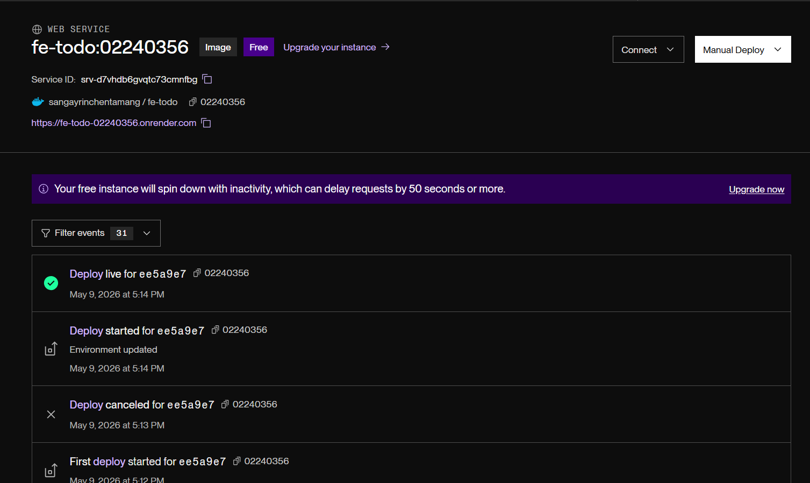
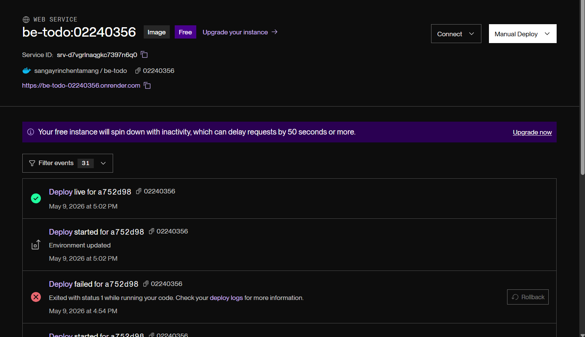
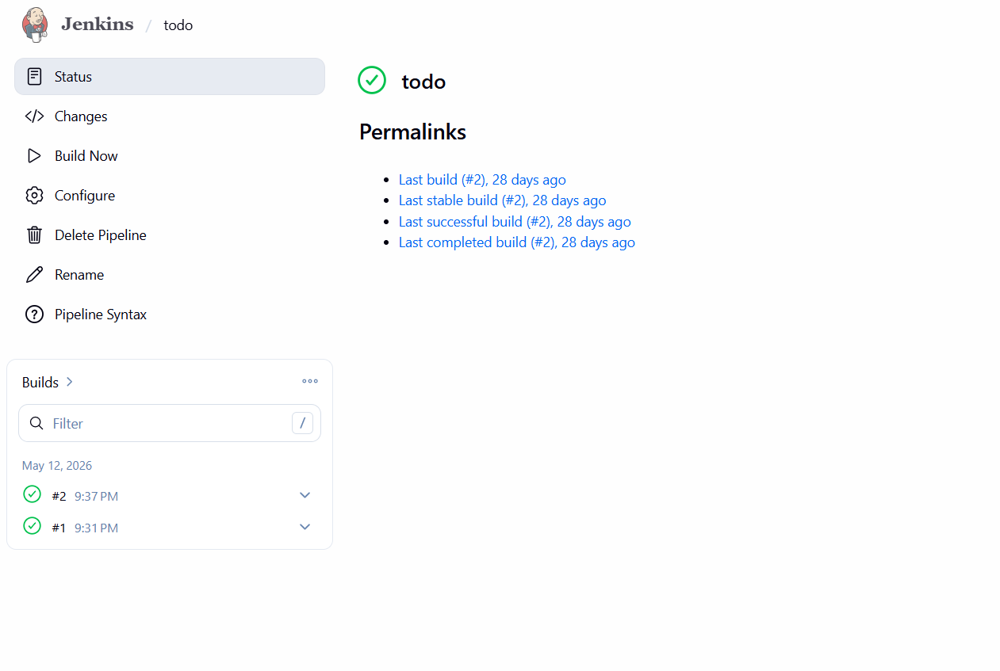

https://github.com/SangayRTamang/SangayRTamang_02230356_DSO101_A1.git

# Assignment 1 report

This report is the steps taken to build and improve the frontend + backend todo app, how the Docker build was fixed. Screenshots are referenced as placeholders (add your own images in the repo and replace the placeholders).

### 1. Implement full CRUD UI (React)
### Steps taken
1. Added frontend logic in src/App.js to:
    Fetch todos (GET /todos)
    Create todo (POST /todos)
    Update todo text + mark done (PUT /todos/:id)
    Delete todo (DELETE /todos/:id)
2. Updated code to match backend endpoints in backend/server.js.
3. Ensured API URL is read from REACT_APP_API_URL environment variable.

### 2. Docker build
### Steps taken in frontend
1. Run sudo docker build --build-arg REACT_APP_API_URL=... -t ... .
2. Build failed with error:
    COPY nginx.conf ... : "/nginx.conf": not found
3. Created nginx.conf in frontend/ next to Dockerfile.
4. Rebuilt successfully.

### Outcome
Docker image builds successfully and pushed to docker hub

### Backend steps taken in backend
1. Set up Express + CORS + JSON body parsing.
2. Loaded DB config from .env and created a pg Pool.
3. Initialized DB on start: CREATE TABLE IF NOT EXISTS todos (...).
4. Implemented CRUD endpoints:

### Deployment in render
After pushing the image in docker hub, I have deployed the image in render to go live.

# Assignment 2 report

This assignment documents the configuration of a Jenkins pipeline to automate the build, test, and deployment of the to-do list application developed in Assignment I. The pipeline covers code checkout from GitHub, dependency installation, building the project, running unit tests, and deploying via Docker.

### Tools and Technologies Used

Jenkins – for CI/CD automation
GitHub – for source code hosting and version control
Node.js and npm – for runtime and package management
Jest with jest-junit – for unit testing and generating JUnit-compatible test reports
Docker – for containerization and deployment

### Pipeline Configuration
### 1 Jenkins Setup
Jenkins was installed locally and accessed at localhost:8080. The following plugins were installed via Manage Jenkins > Plugins > Available:

NodeJS Plugin
Pipeline
GitHub Integration
Docker Pipeline

### 2 GitHub Repository Setup
The Node.js to-do list application from Assignment I was hosted on GitHub. A Personal Access Token (PAT) was generated from GitHub under Settings > Developer Settings > Personal Access Tokens, with repo and admin:repo_hook permissions. These credentials were added to Jenkins under Manage Jenkins > Credentials as a Username and Password entry.

### 3 Jenkinsfile
A Jenkinsfile was created in the root of the repository. It defines five stages:

Checkout: Pulls the latest code from the main branch of the GitHub repository.
Install: Runs npm install to install all project dependencies.
Build: Runs npm run build to compile or bundle the application.
Test: Runs npm test using Jest with the jest-junit reporter to generate JUnit XML reports, which Jenkins reads and displays under Test Results.
Deploy: Builds a Docker image and pushes it to Docker Hub using stored credentials.

### Running the Pipeline
A new Pipeline item was created in Jenkins. The pipeline was configured to use Pipeline script from SCM, with Git as the SCM, pointing to the GitHub repository URL with the stored PAT credentials. The script path was set to Jenkinsfile. After saving, the pipeline was triggered using Build Now.

### Expected Output

All five stages completed successfully with green status.
Build logs confirmed successful dependency installation, build completion, and passing tests.
Test reports were visible in Jenkins under Test Results.
The Docker image was built and pushed to Docker Hub successfully.

# Assignment 3 Report
### Backend
Node.js with Express
Prisma ORM
SQLite via @prisma/adapter-better-sqlite3
CORS support for cross-origin requests
Environment configuration with dotenv
Containerized using backend/Dockerfile

### Frontend
React with Create React App
React Router not used in current implementation
Frontend package managed with npm
Containerized using frontend/Dockerfile

### CI/CD and Deployment
GitHub Actions workflow at .github/workflows/deploy.yml
Docker image build and push to DockerHub
Deployment trigger via Render webhook

### Backend Implementation
### backend/server.js
The backend exposes the following endpoints:

GET / — root route to verify the backend is running
GET /health — health check endpoint
GET /todos — fetch all todo items
POST /todos — create a new todo item
PUT /todos/:id — update an existing todo item
DELETE /todos/:id — delete a todo item

### Database
Uses Prisma Client for database access
Configured to use a local SQLite database by default
Connection string is read from process.env.DATABASE_URL, with fallback to file:./dev.db

### Docker configuration
backend/Dockerfile uses Node 20 slim
Installs dependencies and generates Prisma client
Exposes port 5000
Runs npx prisma db push before starting the server

### Frontend Implementation
### frontend/package.json
Uses React 19 and React Scripts 5
Scripts:
npm start
npm build
npm test

### Docker configuration
frontend/Dockerfile builds the React app inside Node 20 Alpine
Installs dependencies and runs tests
Exposes port 3000
Starts the app with npm start

### CI/CD Pipeline
### Workflow steps
The GitHub Actions workflow performs the following actions on push to main:

Checkout repository
Set up Node.js 20
Install backend dependencies
Generate Prisma client
Run backend tests
Set up Docker Buildx
Log in to DockerHub using secrets
Build and push backend Docker image
Trigger Render deployment via webhook

### Required secrets for the assignment are :
DOCKERHUB_USERNAME
DOCKERHUB_TOKEN
RENDER_WEBHOOK_URL